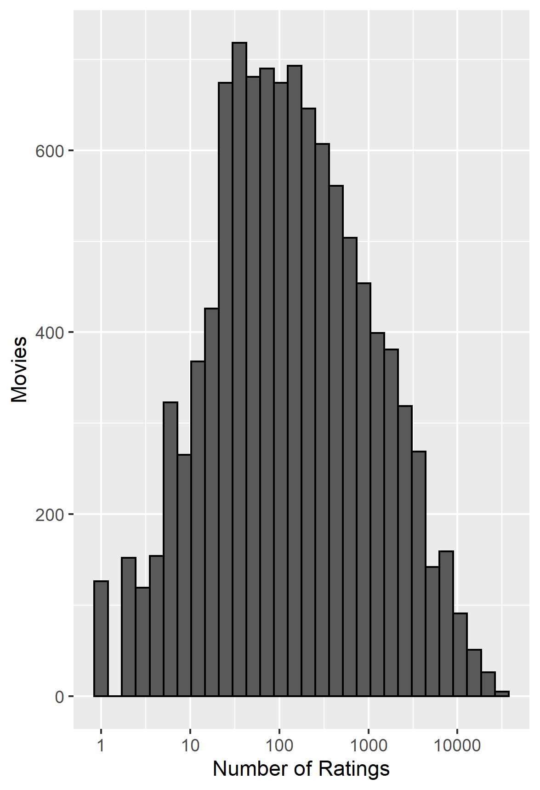
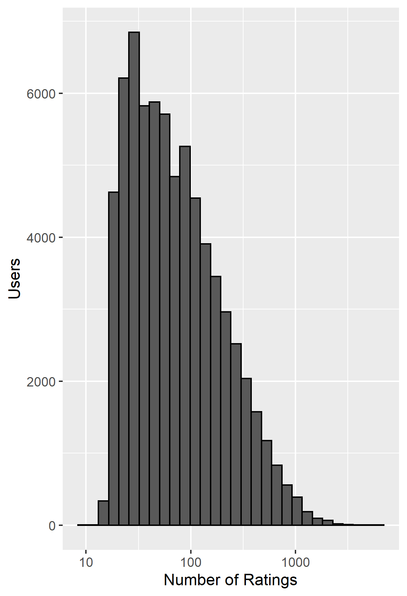
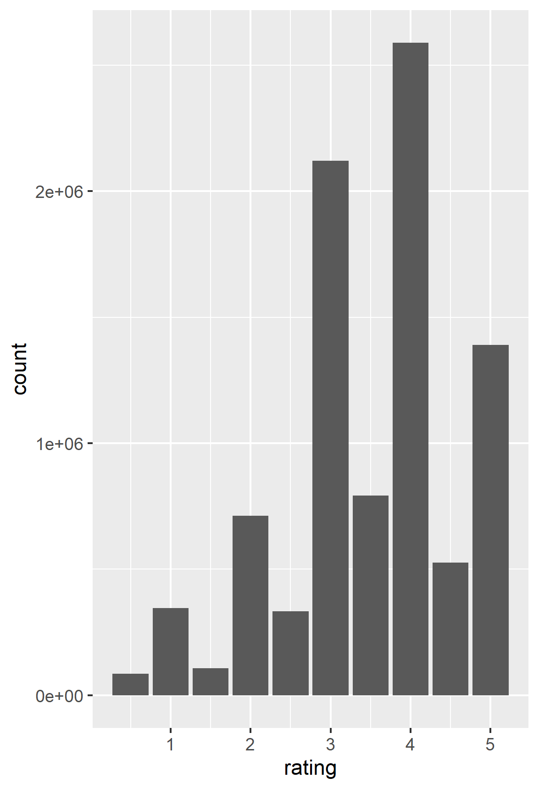
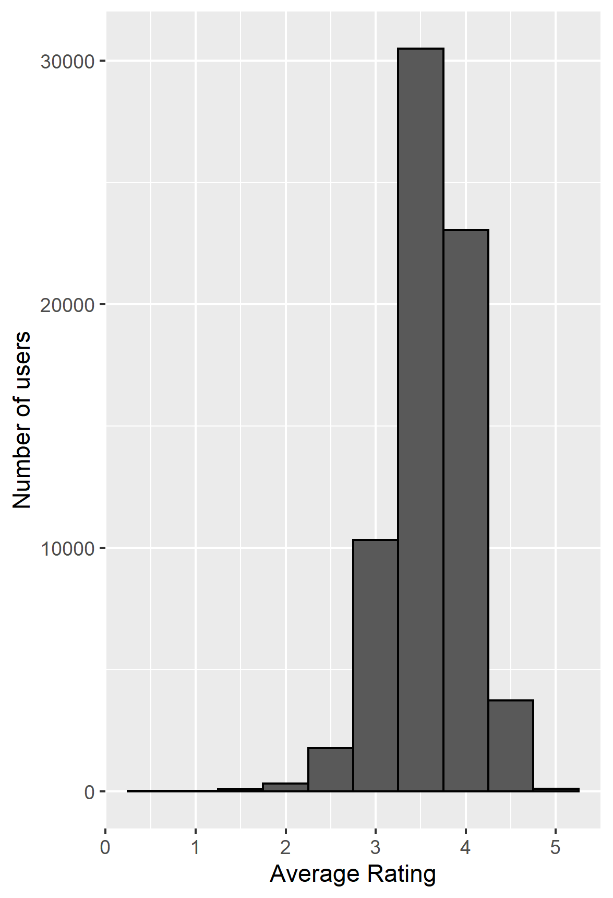

```{r setup, include=FALSE}
knitr::opts_chunk$set(echo = FALSE, message = F, warning = F)
```

```{r kable}
if(!require(kableExtra)) install.packages("kableExtra", repos = "http://cran.us.r-project.org")
library(kableExtra)
```
 

```{r libraries}
if(!require(tidyverse)) install.packages("tidyverse", repos = "http://cran.us.r-project.org")
if(!require(caret)) install.packages("caret", repos = "http://cran.us.r-project.org")
if(!require(data.table)) install.packages("data.table", repos = "http://cran.us.r-project.org")

library(tidyverse)
library(caret)
library(data.table)

set.seed(1, sample.kind="Rounding")

```


# Introduction
The goal of this project is to apply the lessons learned through the Harvard edX Data Science program, and to build upon those lessons. We will do this by utilizing the movieLens dataset to build a model which predicts movie ratings.

The movieLens dataset is provided by Grouplens Research. GroupLens collected rating datasets from the MovieLens web site. For this analysis, we are using the MovieLens 10M Dataset which consists of 10 million ratings of 10,000 movies by 72,000 users (GroupLens, 2021).

In order to develop our model, we separate the edx data set into a training set and a test set. Throughout our model development, we use the training set as the data we know, which our model will learn from, and the test set as the data we do not know, which we will use to compare our predictions to. We use an 80%/20% split for our training and test data sets.

After we have developed our model, we will test it against a validation dataset, which our model has never seen, as a final evaluation of our model's performance and a measure of how we would expect it to perform in a production environment.


# Methods/Analysis

## Data Analysis

First we will explore the structure of the edx dataset by examining the first few rows of the edx dataset.

```{r edxhead}
edx_head <- readRDS(file.path('exploration','edx_head.rds'))
edx_head%>%kbl()%>%kable_minimal()%>%kable_styling(latex_options = c("HOLD_position"))
```

We see that we have six columns in the edx dataset: userId, movieId, rating, timestamp, title, and genres. Each row in the dataset represents a single user's rating for a single movie. 

According to the README provided with the MovieLens 10M dataset, the userId is a unique, anonymized, identifer for a user. The movieId is the real movieLens id. Movie titles are expected to match those in IMDB, and include the year the movie was released. Ratings are on a 5-star scale, in half-star increments. Genres are a pipe-delimited list, from a pre-selected list of genres (GroupLens, 2021).

We can use the summary() function to see the the summary statistics for each column of the dataset, and confirm that we do not have any null values.
```{r edxsummary}
edx_summary <- readRDS(file.path('exploration','edx_summary.rds'))
edx_summary%>%kbl()%>%kable_minimal()%>%kable_styling(latex_options = c("HOLD_position"))
```

We can see the number of distinct movies and users in the edx dataset:

```{r distinct}
edx_distinct_um <- readRDS(file.path('exploration','edx_distinct_um.rds'))
edx_distinct_um%>%kbl()%>%kable_minimal()%>%kable_styling(latex_options = c("HOLD_position"))
```

Since the number of rows in the dataset is much lower than the number of distinct users times the number of distinct movies, we know that not every user has rated every movie. We can look at the distribution of ratings per movie to illustrate this, and see that the distribution looks roughly normal. Some movies have very few ratings, while other movies are widely rated by users. 





We can also examine the activity of the users by looking at the distribution of ratings each user has provided. Here we see a left-skewed distribution, which indicates that it is more common for users to only rate a few movies, than to rate very many movies.





We can also examine the distribution of the movie ratings in the dataset, and observe that in general, half star ratings are less frequent than whole star ratings.




We also look at the distribution of genres in the dataset. Given that the genres variable is a pipe-separated list of film genres for the movie, we will use separate_rows() to seee how many instances of each of the 19 base genres are present.

```{r seprows}
genres <- readRDS("distinct_genres.rds")
as.data.frame(genres) %>% kbl()%>% kable_minimal()%>%kable_styling(latex_options = c("HOLD_position"))
```


## Model Development

### Simple Model
As we think about how we can tackle this problem, we start with the simplest approach and predict the same rating for all movies, regardless of user. We can write this as:

$Y_{u,i} = \mu + \epsilon_{u,i}$

where the $\epsilon_{u,i}$ are independent errors and $\mu$ is the true rating for all movies. The estimate that minimizes the RMSE of this model is the least squares estimate of $\mu$, which is the average of all ratings. 

We first calculate the average of all the ratings in the train set:

```{r mu}
mu <- readRDS(file.path('model_outputs','mu_hat.rds'))
mu
```

We then calculate the RMSE using this simple model and comparing to the actual ratings in the test set, and create a table to store the RMSE of each of our models in.

```{r rmseResults}
#read in RMSE results table
rmse_1_file <- file.path('model_outputs','model_1_rmse_results.rds')
rmse_results_1 <- readRDS(rmse_1_file)
rmse_results_1 %>%kbl%>%kable_minimal()%>%kable_styling(c("bordered","condensed"),latex_options = c("HOLD_position"))
```

### Movie Effect

Intuitively, we know that some movies are generally rated higher than others. We can see this in the data if we look at the lowest rated movies.

```{r lowestrated}
#find the lowest rated movies
lowest_rated <- readRDS(file.path('exploration','lowest_rated.rds'))
lowest_rated %>%kbl%>%kable_minimal()%>%kable_styling(c("bordered","condensed"),latex_options = c("HOLD_position"))
```

We note that the lowest rated movies are those which only have one or two ratings and are fairly obscure movies. 

We can also look at the top rated movies in the dataset and see familiar films that we would expect to be widely highly rated.

```{r toprated}
#highest rated movies
highest_rated <- readRDS(file.path('exploration','highest_rated.rds'))
highest_rated%>%kbl%>%kable_minimal()%>%kable_styling(c("bordered","condensed"),latex_options = c("HOLD_position"))
```

We adjust our initial model to account for this movie effect by adding a new term, $b_{i}$, which represents the average ranking for movie $i$:

$Y_{u,i} = \mu + b_{i} + \epsilon_{u,i}$

We obtain this movie effect by finding the average rating for each movie in the training data set. We then apply this model to the test set to find our predicted ratings, and calculate the RMSE of our predictions and the actual ratings in the test set. We see an improvement in the RMSE by adding the movie effect to our model.

```{r movieavgspredict}
#read in RMSE results table
rmse_2_file <- file.path('model_outputs','model_2_rmse_results.rds')
rmse_results_2 <- readRDS(rmse_2_file)
rmse_results_2 %>%kbl%>%kable_minimal()%>%kable_styling(c("bordered","condensed"),latex_options = c("HOLD_position"))
```


### User Effect
As we saw in our data exploration, some users are significantly more active than others. 

From experience, we also know that some users will generally rank movies higher than others, and other users will only rate those movies at the extreme ends of their opinions (either loved the movie or hated the movie). This is supported by looking at the average rating by user, where we see that different users have different average ratings.





This leads us to explore the addition of a user effect. We again adjust our model and add a new term  $b_{u}$, which represents the average ranking for user $u$.

$Y_{u,i} = \mu + b_{i} + b_{u}  + \epsilon_{u,i}$

We again see an improvement in our RMSE, and that we have increased the accuracy of our model's predictions.

```{r useravgs}
#read in RMSE results table
rmse_3_file <- file.path('model_outputs','model_3_rmse_results.rds')
rmse_results_3 <- readRDS(rmse_3_file)
rmse_results_3 %>%kbl%>%kable_minimal()%>%kable_styling(c("bordered","condensed"),latex_options = c("HOLD_position"))
```


### Genre Effect

We also expect that some genres will be more popular than others.We take the naive approach and look at capturing the genre effect at the category level first i.e. Action|Drama|Romance, instead of the individual genres.

We add a term, $b_{g}$ to our model to capture this genre effect:

$Y_{u,i} = \mu + b_{i} + b_{u} +b_{g} + \epsilon_{u,i}$

Here, we see a negligble improvement in our RMSE as it is less than half a percent.

```{r genreavgs}
#read in RMSE results table
rmse_4_file <- file.path('model_outputs','model_4_rmse_results.rds')
rmse_results_4 <- readRDS(rmse_4_file)
rmse_results_4 %>%kbl%>%kable_minimal()%>%kable_styling(c("bordered","condensed"),latex_options = c("HOLD_position"))
```


### Regularization

Next, we explore where our model made mistakes, and look at our top 10 largest residuals.
```{r top10}
top_10_errors <- readRDS(file = file.path('model_outputs','top_10_errors.rds'))

top_10_errors%>%select(movieId, title,rating,residual)%>%arrange(movieId)%>%
  kbl%>%kable_minimal()%>%kable_styling(c("bordered","condensed"),latex_options = c("HOLD_position"))

```

We note that we have a mix of well-known movies and obscure movies here. We look at how frequently these movies are rated in the dataset.
```{r top10movies}
top_10_errors_ratingcount <- readRDS(file.path('model_outputs','top_10_errors_ratingcount.rds'))
top_10_errors_ratingcount%>%kbl%>%kable_minimal()%>%kable_styling(c("bordered","condensed"),latex_options = c("HOLD_position"))
```
Some of the movies have been rated many times, and we have users which have rated them much lower than others, while some of these movies have much fewer ratings. We can penalize those movies with very few ratings, which are subject to more noise in the estimates.


### Movie Effect Regularization


We use regularization on our movie effect model by introducing a new parameter, lambda, into our model, and instead of minimizing the least squares equation, we minimize a new equation with a penalty term:

$\sum_{u,i}(y_{u,i}-\mu-b_{i})^2 + \lambda\sum_{i}b_{i}^2$

We use 5-fold cross-validation to select the value of lambda. We then plot the values of lambda against the average RMSE calculated to see which value of lambda minimizes the RMSEs.

```{r moviereg}
#define lambdas to test
lambdas <- seq(0,10,0.25)
#for each lambda, take the mean of the RMSES
file <- file.path('model_outputs','movie_reg_rmses_cv.rds')
rmses_cv <- readRDS(file)
qplot(lambdas,rmses_cv)

```


We choose the value of lambda which minimizes the average RMSE and apply it to our model. We calculate the RMSE of the regularized model to see if it improves.

```{r movieregRMSE}
#read in RMSE results table
rmse_5_file <- file.path('model_outputs','model_5_rmse_results.rds')
rmse_results_5 <- readRDS(rmse_5_file)
rmse_results_5 %>%kbl%>%kable_minimal()%>%kable_styling(c("bordered","condensed"),latex_options = c("HOLD_position"))
```


### Movie + User Effect Regularization

Next we look at tuning the model with both the movie effect and user effect. We modify our model:

$\sum_{u,i}(y_{u,i}-\mu-b_{i}-b_u)^2 + \lambda(\sum_{i}b_{i}^2 +\sum_{i}b_{u}^2)$

We again use 5-fold cross validation to choose lambda and plot the values of lambda against the average RMSE calculated to see which value of lambda minimizes the RMSEs.

```{r movieuserlambda}
#define lambdas to test
lambdas <- seq(0,10,0.25)

#for each lambda, take the mean of the RMSES
file <- file.path('model_outputs','movieuser_reg_rmses_cv.rds')
rmses_cv <- readRDS(file)
qplot(lambdas,rmses_cv)

```

We choose the value of lambda which minimizes the average RMSE and apply it to our model. We calculate the RMSE of the regularized model to see if it improves.

```{r movieuserregRMSE}

#see if RMSE improved
rmse_6_file <- file.path('model_outputs','model_6_rmse_results.rds')
rmse_results_6 <- readRDS(rmse_6_file)
rmse_results_6 %>%kbl%>%kable_minimal()%>%kable_styling(c("bordered","condensed"),latex_options = c("HOLD_position"))


```


### Movie + User + Genre Effect Regularization
Next we look at look at tuning the model with the movie effect, user effect, and genre effect. We again modify our model:

$\sum_{u,i}(y_{u,i}-\mu-b_{i}-b_{u} - b_{g})^2 + \lambda(\sum_{i}b_{i}^2 +\sum_{i}b_{i}^2+\sum_{u}b_{g}^2)$

We again use 5-fold cross validation to choose lambda and plot the values of lambda against the average RMSE calculated to see which value of lambda minimizes the RMSEs.


```{r movieusergenre}

#define lambdas to test
lambdas <- seq(0,10,0.25)


#for each lambda, take the mean of the RMSES
file <- file.path('model_outputs','movieusergenres_reg_rmses_cv.rds')
rmses_cv <- readRDS(file)
qplot(lambdas,rmses_cv)
#find the lambda with the minimum average RMSEs
lambda <- lambdas[which.min(rmses_cv)]
```


We choose the value of lambda which minimizes the average RMSE and apply it to our model. We calculate the RMSE of the regularized model to see if it improves.

```{r movieusergenreRMSE}
#read in RMSE file
rmse_7_file <- file.path('model_outputs','model_7_rmse_results.rds')
rmse_results_7 <- readRDS(rmse_7_file)
rmse_results_7 %>%kbl%>%kable_minimal()%>%kable_styling(c("bordered","condensed"),latex_options = c("HOLD_position"))
```


### Matrix Factorization
Finally we consider another technique to see if we can further improve the RMSE. If we consider an m x n matrix of ratings, with n columns for each movie in the dataset, and m rows for each user in the dataset, the value in row m and column n is the rating provided by that user for that movie. 

As described by r-bloggers.com, the idea of matrix factorization is to approximate this m x n rating matrix as the product of two matrices of lower dimensions, $P_{k\times m}$ and $Q_{k\times n}$. Then, if $p_u$ is the $u$-th column of $P$, and $q_v$ is the $v$-th column of $Q$, we will predict the rating given by user $u$ on item $v$ as $p’_u q_v$.

We implement this using the recosystem package. We tune and train the model using the default values, and calculate the RMSE of the model.

```{r matrixfact}
#read in RMSE file
rmse_8_file <- file.path('model_outputs','model_8_rmse_results.rds')
rmse_results_8 <- readRDS(rmse_8_file)
rmse_results_8 %>%kbl%>%kable_minimal()%>%kable_styling(c("bordered","condensed"),latex_options = c("HOLD_position"))
```


# Results
The matrix factorization model has the best RMSE on the test set, so this is the one we select as our final model. We apply it to the final validation set and calculate the RMSE.

```{r finalRMSE}
#open the predicted ratings file
final_rmse_file <- file.path('model_outputs','final_rmse.rds')
final_RMSE <- readRDS(final_rmse_file)
final_RMSE
```

# Recommendations for Further Improvements
As demonstrated in this project, the genre categories as presented in the dataset did little to improve the RMSE. However, this project could be furthered by investigating the impact of each individual genre, and their interactions as a category as a multiple linear regression model:

$Y_{u,i} = \mu + b_{i} + b_{u} +\sum_{k=1}^{K}x_{}^k\beta_{k} + \epsilon_{u,i}$ with $x_{u,i}^k = 1$ if $g_{u,i}$ is genre $k$. 

However, due to system limitations, we were unable to perform this calculation on a dataset of this size.

Additionally, we could consider the year of release of a film as compared to the year of a review - we might expect to see very old movies rated highly (i.e. the classics), as well as an effect for brand new movies rated highly i.e. summer blockbusters.

We would also like to further investigate the usage of matrix factorization, and explore the impact the additional features like genres, or movies in a series (i.e. Godfather 1, Godfather 2, Godfather 3).

# Conclusion
This project aimed to build on the material presented through the Harvard edX machine learning course and chapter 33 of _Introduction to Data Science,Data Analysis and Prediction Algorithms with R_, and to demonstrate the knowledge gained through the program as a whole through the development of a movie rating prediction model. This project explored multiple aspects of the MovieLens dataset and the effects of the movie, user, and genre on the rating, as well as the matrix factorization technique. 

# References
1. Irizarry, Rafael A (May 24,2021). _Introduction to Data Science,Data Analysis and Prediction Algorithms with R_. https://rafalab.github.io/dsbook/

2. GroupLens, 2021. _MovieLens_. https://grouplens.org/datasets/movielens/

3. Yixuan's Blog - R (July 14,2016). _recosystem: Recommender System Using Parallel Matrix Factorization_ https://www.r-bloggers.com/2016/07/recosystem-recommender-system-using-parallel-matrix-factorization/